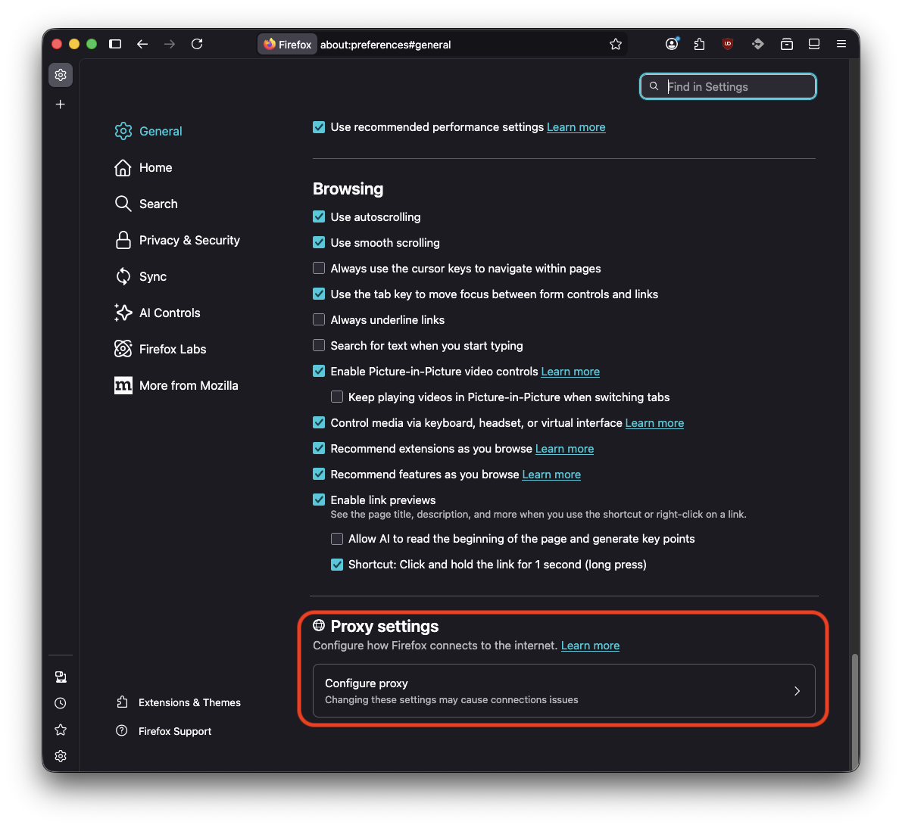
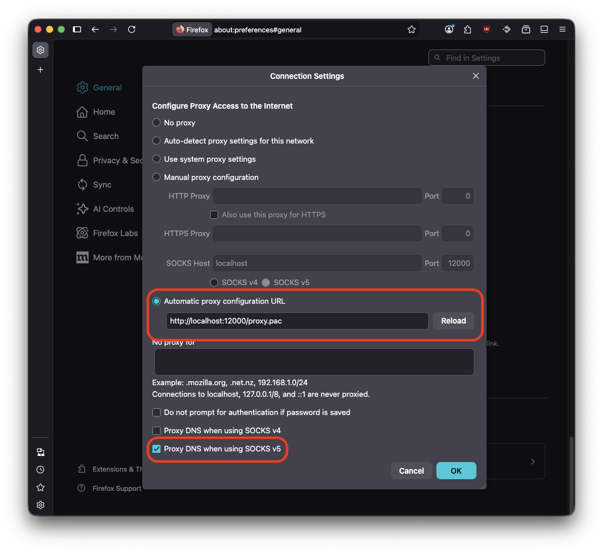

# Firefox Setup

## Prerequisites

- Firefox browser installed on your machine.
- Kharon proxy server is running at the default address `tcp://localhost:12000`.
  Optimally Kharon is installed using `kharon install`.

## Configure Firefox to Use Kharon Proxy

. Open Firefox and navigate to `about:preferences` in the address bar.
. Scroll down to the "Proxy settings" section and click on the "Configure proxy" button.
+

. Select the "Automatic proxy configuration URL" option.
. In the input field, enter the following URL to point Firefox to the Kharon proxy configuration:
+
[source]
----
https://raw.githubusercontent.com/vshn/kharon/main/static-proxy.pac
----
+
[NOTE]
====
Experimental: Kharon provides a dynamic proxy configuration file that might improve performance by allowing Firefox to bypass the proxy for certain domains. This feature is currently experimental and may not work as expected in all cases. If you encounter issues, you can switch back to the static proxy pac file.

[source]
----
http://localhost:12000/proxy.pac
----
====

. Select "Proxy DNS when using SOCKS v5".
+

. Click "OK" to save the proxy settings.
